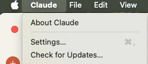
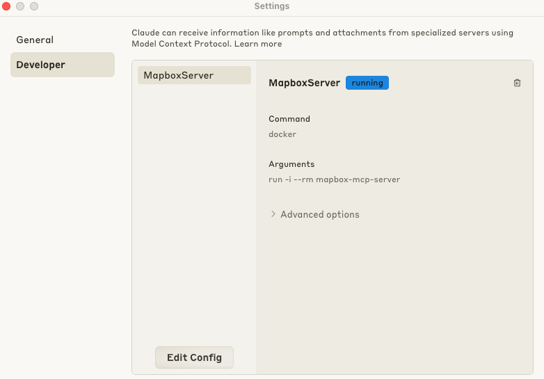
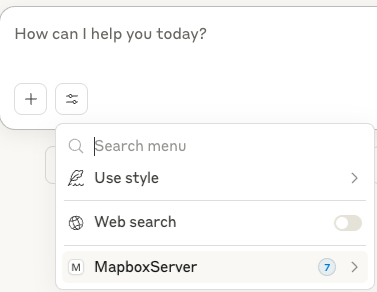
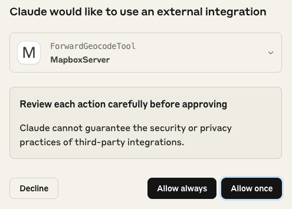
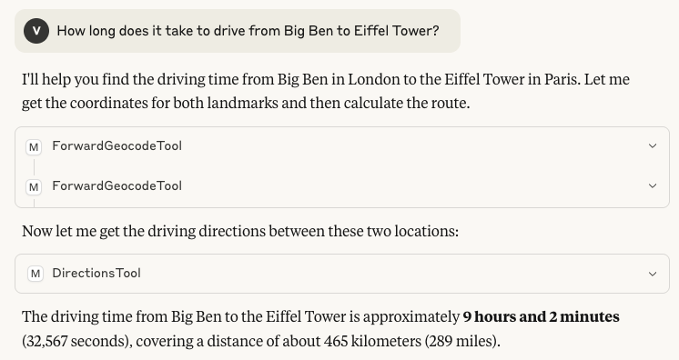

# Claude Desktop Setup

This guide explains how to set up and configure Claude Desktop for use with the Mapbox MCP Server.

## Requirements

- Claude Desktop application installed on your system

If you want to use locally, you need also do:

- Mapbox MCP Server built locally

```sh
# from repository root:
# using node
npm run build

# note your absolute path to node, you will need it for MCP config
# For Mac/Linux
which node
# For Windows
where node

# or alternatively, using docker
docker build -t mapbox-mcp-server .
```

## Setup Instructions

### Install Claude Desktop

[Download](https://claude.ai/download) and install the Claude Desktop application from the official page.

### Configure Claude to use Mapbox MCP Server

1. Open Claude Desktop settings
   
1. Navigate to the Model Context Protocol section
   
1. Modify claude_desktop_config.json to add new server, for example:

   - Using NPM package
     ```json
     {
       "mcpServers": {
         "MapboxServer": {
           "command": <PATH_TO_YOUR_NPX>,
           "args": [ "-y", "@mapbox/mcp-server"],
           "env": {
             "MAPBOX_ACCESS_TOKEN": <YOUR_TOKEN>
           }
         }
       }
     }
     ```
   - If you want to use local Node.js version (Need to clone and build from this repo)

     ```json
     {
       "mcpServers": {
         "MapboxServer": {
           "command": <PATH_TO_YOUR_NODE>,
           "args": ["YOUR_PATH_TO_GIT_REPOSITORY/dist/index.js"],
           "env": {
             "MAPBOX_ACCESS_TOKEN": "YOUR_TOKEN"
           }
         }
       }
     }
     ```

   - Alternatively, using docker:

     ```json
     {
       "mcpServers": {
         "MapboxServer": {
           "command": "docker",
           "args": [
             "run",
             "-i",
             "--rm",
             "-e",
             "MAPBOX_ACCESS_TOKEN=YOUR_TOKEN",
             "mapbox-mcp-server"
           ]
         }
       }
     }
     ```

### Using Mapbox Tools in Claude

Once configured, you can use any of the Mapbox tools directly in your Claude conversations:

- Request directions between locations
- Search for points of interest
- And more

#### You should see Mapbox Server appear in tools menu



#### You will be asked to approve access on first use



#### Example of working tools



Note, the results can vary based on current traffic conditions and exact values of parameters used.
