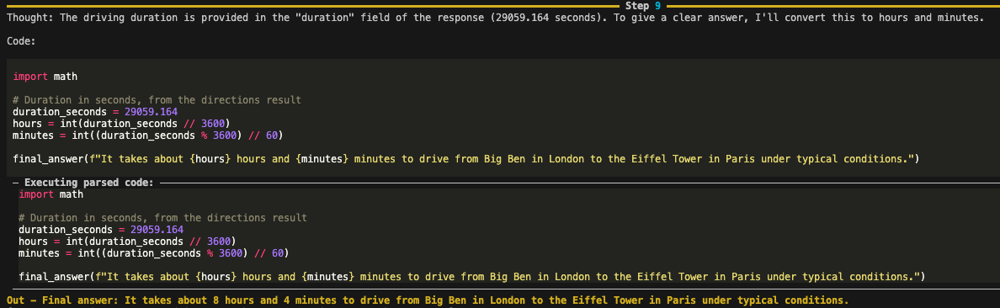

# Using Smolagents with Mapbox MCP

This example demonstrates how to integrate Mapbox's Model Context Protocol (MCP) server with Smolagents, allowing AI agents to access Mapbox's location-based tools.

## Overview

The `smolagents_example.py` script shows a simple but powerful implementation of connecting an AI agent to Mapbox's MCP server. It enables the agent to perform location-based tasks such as:

- Getting directions between landmarks
- Searching for points of interest
- Geocoding locations
- Calculating travel times and distances
- Generating static map images
- And more...

## Prerequisites

- Python with `smolagents` and `mcp` packages installed: `pip install 'smolagents[mcp]'`
- A Mapbox access token (set as an environment variable)
- Node.js or docker (to run the MCP server)

With NPM package, you don't need to clone this repository, and build it. But If you want to use the local codes, you need to clone and build it:

```sh
# Build node (from repository root)
npm run build

# note your absolute path to node, you will need it for MCP config
# For Mac/Linux
which node
# For Windows
where node

# Alternatively, build docker
docker build -t mapbox-mcp-server .
```

## How It Works

The script demonstrates different ways to configure language models:

1. **InferenceClient**: For hosted models
2. **Transformers**: For local models through HuggingFace
3. **Ollama**: For local models through Ollama
4. **LiteLLM**: For accessing various API-based models
5. **OpenAI**: For OpenAI's models

It connects to the Mapbox MCP server, which exposes Mapbox's functionality as tools that the AI agent can use to answer location-based questions.

## Getting Started

1. Set your Mapbox access token:

   ```
   export MAPBOX_ACCESS_TOKEN=your_token_here
   ```

2. Update the path to your node and the MCP server in the script:

   - If you want to use NPM version:

     ```python
     server_parameters = StdioServerParameters(
        command=<YOUR_NPX_PATH>,
        args=["-y", "@mapbox/mcp-server"],
        env={"MAPBOX_ACCESS_TOKEN": os.environ["MAPBOX_ACCESS_TOKEN"]},
     )
     ```

   - If you want to use the local code version from this repository:
     ```python
     server_parameters = StdioServerParameters(
        command=<YOUR_NODE_PATH>,
        args=["/YOUR_PATH_TO_REPOSITORY/dist/index.js"],
        env={"MAPBOX_ACCESS_TOKEN": os.environ["MAPBOX_ACCESS_TOKEN"]},
     )
     ```

3. Choose your preferred model by setting the `chosen_inference` variable

4. Run the example:
   ```
   python smolagents_example.py
   ```

The example asks the agent how long it takes to drive from Big Ben to the Eiffel Tower, demonstrating how the agent can use Mapbox's tools to provide a meaningful answer.

If everything works well you can expect output that looks like this:


## Customization

You can modify the question at the end of the script to test different location-based queries:

```python
agent.run("Your location-based question here")
```

## Learn More

For more information about:

- Smolagents: [Smolagents Documentation](https://github.com/smol-ai/smolagents)
- Mapbox MCP: See the [main repository documentation](../../README.md)
- Additional setup guides:
  - [Claude Desktop Setup](../claude-desktop-setup.md)
  - [VS Code Setup](../vscode-setup.md)
