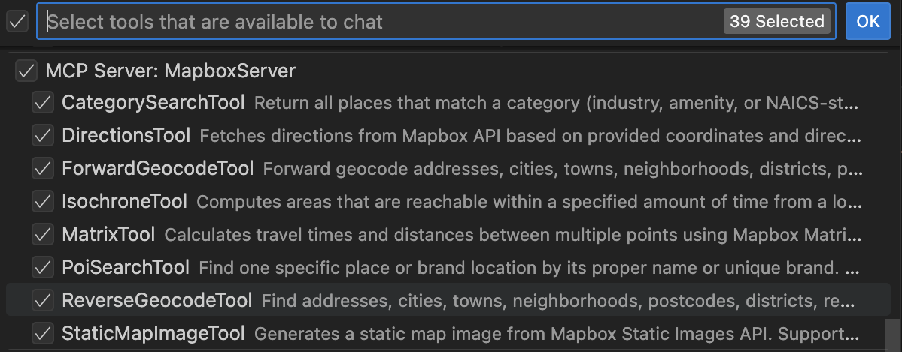
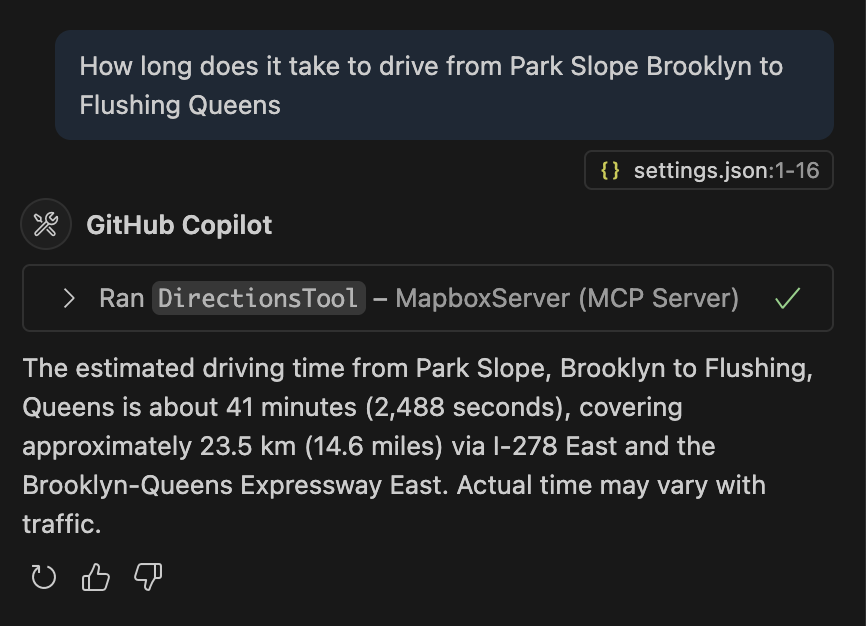

# VS Code Setup

This guide explains how to configure VS Code for use with the Mapbox MCP Server.

## Requirements

- VS Code installed and configured with copilot
- Mapbox MCP Server built locally

```sh
# from repository root:
# using node
npm install
npm run build

# note your absolute path to node, you will need it for MCP config
# For Mac/Linux
which node
# For Windows
where node

# or alternatively, using docker
docker build -t mapbox-mcp-server .
```

## Setup Instructions

### Configure VS Code to use Mapbox MCP Server

1. Go to your `settings.json`
1. At the top level add MCP config, for example:
   - NPM version
     ```json
         "mcp": {
             "servers": {
                 "MapboxServer": {
                     "type": "stdio",
                     "command": <PATH_TO_YOUR_NPX>,
                     "args": ["-y", "@mapbox/mcp-server"],
                     "env": {
                         "MAPBOX_ACCESS_TOKEN": <YOUR_TOKEN>
                     }
                 }
             },
         },
     ```
   - Docker version
     ```json
         "mcp": {
             "servers": {
                 "MapboxServer": {
                     "type": "stdio",
                     "command": "docker",
                     "args": [
                         "run",
                         "-i",
                         "--rm",
                         "mapbox-mcp-server"
                     ],
                     "env": {
                         "MAPBOX_ACCESS_TOKEN": "YOUR_TOKEN"
                     }
                 }
             },
         },
     ```
   - Node version
     ```json
         "mcp": {
             "servers": {
                 "MapboxServer": {
                     "type": "stdio",
                     "command": <PATH_TO_YOUR_NODE>,
                     "args": [
                         "/YOUR_PATH_TO_GIT_REPOSITORY/dist/index.js"
                     ],
                     "env": {
                         "MAPBOX_ACCESS_TOKEN": "YOUR_TOKEN"
                     }
                 }
             },
         },
     ```

You might need to restart VS Code. You should see Mapbox Server appear in tools menu.



#### Example of working tools



Note, the results can vary based on current traffic conditions and exact values of parameters used.
